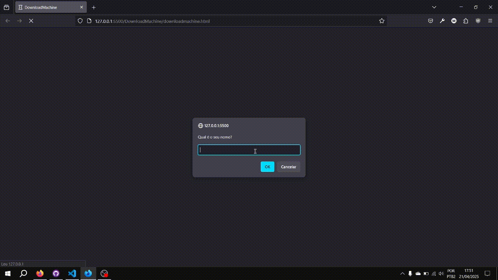

<!-- Emojis and IMG!!!! -->
<!-- ✅, ❌, ⚠️, ❗,  -->

<!-- Programing Languages Ico -->
<!-- Html Image Link:  -->

<!-- Css Image Link:  -->

<!-- JavaScript Image Link:  -->

<!-- Python Image Link:  -->

<!-- ETC -->

<!-- Software Img Link:  -->

# **DownloadMachine✨**

## **WHAT IS THIS?👀**
 A website for download cool software and use!
## **HOW TO USE?🤷‍♂️**
  Click in the bow with an arrow, select the software for download. Do you want select other language? Click in "Config"
  and click in Usa Flag and enjoy!!
## STATUS😉
 Things | Completed?
 ---       | ---
 Html | ✅
 Css | ✅
 JavaScript | ✅
 Software  | ✅
# CONCLUSION🌟
 All is working fine without bugs or crashes and all software is translated for English.

###### ⚠️[MIT License]⚠️
###### ***Thanks for Read🙏***